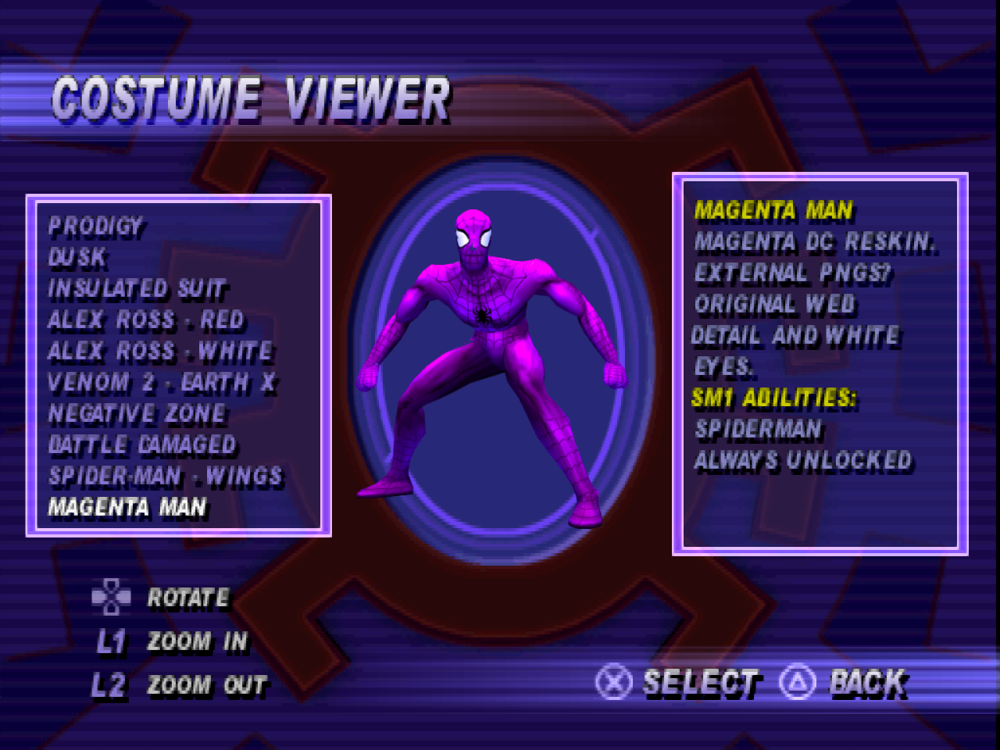

# OpenSpideyPS1

Native recompilations of **Spider-Man** and **Spider-Man 2: Enter Electro** for
Windows, built with [RecompOne](https://github.com/BlackLabelHQ/RecompOne).
The PlayStation code is translated to C# ahead of time and runs against a shared
runtime that implements the original console services, with modern rendering and
higher-detail character assets.

This is an active development project, not a claim of complete game compatibility.
Both games reach gameplay; targeted menu, level, costume and renderer tests do not
replace full playthroughs or long-duration stability testing.

## Current features

- **Modern rendering in both games:** perspective-correct textured geometry,
  no PS1 dithering or 5-bit output quantization, increased internal resolution,
  and host-resolution FXAA enabled by default. Both 4:3 and 16:9 use the modern
  renderer; legacy rendering is reserved for developer reference.
- **Widescreen gameplay:** wider projection and HUD handling in both games.
  SM2 defaults to 16:9; SM1 currently enables it with `SPIDEY_WIDE=1`.
  Menus retain their original 4:3 layout.
- **Dreamcast character upgrades:** SM1 uses converted DC actors where applicable;
  SM2's upgrade work focuses on Spider-Man and costumes, not matching every NPC.
  Character textures use external host-resolution packs. Environments remain
  the original PS1 environments.
- **Twenty built-in SM1 costumes:** the ten original suits plus ten imported SM2
  entries. Imported suits use SM1 animations and copied SM1 ability profiles, with
  paired existing unlock events. The winged default SM2 suit is available from
  the start. Original SM1 default Spider-Man remains visually wingless.
- **Data-only SM1 reskin mods:** external PNGs, custom names and comments, and a
  choice of existing SM1 power profiles, all using the included DC default
  Spider-Man model. Mod suits are always unlocked and do not replace built-ins.
- **First-run disc setup:** published builds are self-contained executables with
  an embedded installer. Extraction runs inside the game window with progress
  and elapsed time, then subsequent launches use loose files.

## Make a reskin

[](docs/screenshots/magenta-man-costume-selector.png)

**Proof of reskin mod capability:** Magenta Man uses the Dreamcast Spider-Man
model with external PNG textures. The costume viewer displays `COSTUME:` from
the JSON name, `GAME POWERS:` from the selected SM1 ability profile, and
`COMMENTS:` from the author's text.

**Maximum: 12 custom mod costumes**, including Magenta Man, alongside the 20
built-in suits (32 costumes total).

1. Copy [Magenta Man](mods/samples/magenta-man) into
   `mods/suits/magenta-man` beside `SpiderMan.exe`.
2. Follow [instructions.txt](mods/samples/magenta-man/instructions.txt): paint the
   PNGs and edit `suit.json` to name your costume and choose its powers.
3. Restart and select it under **SPECIAL → COSTUME VIEWER**.

The [TEMPLATE folder](mods/samples/magenta-man/TEMPLATE) contains texture copies
stamped with Blender-exported UV layouts; `TEMPLATE/UV` contains the original SVG
outlines for separate editing layers. The game ignores these guides. Keep their
lines out of the finished textures.

There is no model/donor field: reskins always use DC default Spider-Man.
The mod-count maximum is an explicit selector capacity, not a texture-resolution limit. Only the
active reskin's textures are decoded. PNGs can be up to 4096×4096 within a 64 MiB
decoded-pixel budget per suit; Magenta Man includes a 2048×2048 example. That
example is enlarged source art, not newly painted HD detail.

Textures stay in host memory and GPU storage rather than overwriting the game's
original model or texture allocations. This reskin loader does not accept arbitrary
models or executable code. See [developer notes](docs/magenta-man-mod-development.md)
for validation rules and regression tests. This sample loader is currently **SM1 only**.

## Run a published build

Launch the game's executable and provide the requested retail BIN/CUE dump when
prompted. Select its **CUE sheet**; the matching BIN files must be present.

| Executable | Required disc | ID |
|---|---|---|
| `SpiderMan.exe` | Spider-Man (USA) | SLUS-00875 |
| `SpiderMan2.exe` | Spider-Man 2: Enter Electro (USA) (Rev 1) | SLUS-01378 |

The installer validates the exact supported dump before extraction. It does not
open a command-prompt window. After installation, the original image is no longer
needed for play.

Game files live under `game/` beside the executable; bundled character replacements
and texture packs live under `assets/builtin/`. User reskins belong in `mods/suits/`,
not inside the built-in asset folder. Each game has its own settings and data.
The bundled replacements do not require a Dreamcast disc, and SM1's imported
costumes do not require an SM2 disc at installation time.

See [first-run installation](docs/first-run-installation.md) for validation,
installation layout and recovery details.

## Build from source

Development builds require .NET 10, Python 3 with NumPy and Pillow, and the
appropriate retail disc data. Start in the directory of the game being built:

```powershell
cd spiderman        # or spiderman2
python tools/disc.py extract extracted
python tools/cdwad.py extract extracted/wad
python tools/overlays.py build config/overlays
python tools/genmaps.py
python tools/build.py
```

BIN/CUE is import media, not the runtime format. The extractor produces loose files
and `recompone-disc.json`; later builds and launches use that directory.
Raw source discs and extracted retail files must not be added to Git.

From the repository root, publish a self-contained executable with:

```powershell
dotnet publish spiderman/port/SpiderMan.csproj -c Release
dotnet publish spiderman2/port/SpiderMan2.csproj -c Release
```

Outputs are `spiderman/port/dist/SpiderMan.exe` and
`spiderman2/port/dist/SpiderMan2.exe`. Ordinary builds instead use each project's
`port/bin/Release/net10.0/` directory. Published builds embed each game's
`port/bundled/runtime-assets.zip`; asset maintainers rebuild those payloads using
`python dreamcast/tools/build_bundled_runtime_assets.py` after approved changes.

### Development switches

Both games use the `SPIDEY_*` prefix, but level and costume names differ.
Set environment variables before starting the executable.

| Variable | Purpose |
|---|---|
| `SPIDEY_WIDE=1` / `0` | Enable / disable widescreen gameplay; neither selects legacy rendering |
| `RECOMP_RENDER_SCALE=4` | Internal rendering scale, from 1 to 8 |
| `RECOMP_FXAA=0` | Disable the normally enabled FXAA pass |
| `SPIDEY_LEVEL=l1a1` | Direct SM1 level boot; SM2 uses names such as `e1m0` |
| `SPIDEY_COSTUME=symbiote` | Select an SM1 built-in costume for testing |
| `SPIDEY_CHEATS=all` | Enable the game's cheat set |
| `SPIDEY_SHOTS=1050,1500` | Save native captures at specified frames |
| `SPIDEY_SNAP=crash` | Dump game RAM on a crash |

## Project layout and technical notes

`spiderman/` and `spiderman2/` have separate game code, configuration, extracted
data and output. `tools/RecompOne/` contains the shared recompiler/runtime;
`dreamcast/` contains character-conversion and audit tooling, not a third game port.

- [SM1 technical notes](spiderman/README.md)
- [SM2 technical notes](spiderman2/README.md)
- [Dreamcast extraction and conversion](dreamcast/README.md)
- [DC character-port pipeline](docs/ports/dreamcast-characters-in-ps1-sm1.md)
- [Reskin implementation and tests](docs/magenta-man-mod-development.md)

Older per-game investigation notes record the results of particular builds and
test routes. They should not be read as guarantees that every map, costume or
long-session scenario currently passes.

## Rights

Spider-Man, Spider-Man 2: Enter Electro, their characters and original assets belong
to their respective rights holders. This is an unofficial project. Players supply
the supported retail PS1 disc for the game they run. Converted character assets
and the sample reskin are distinct from the port's source code; their inclusion
does not transfer ownership of the underlying art.
