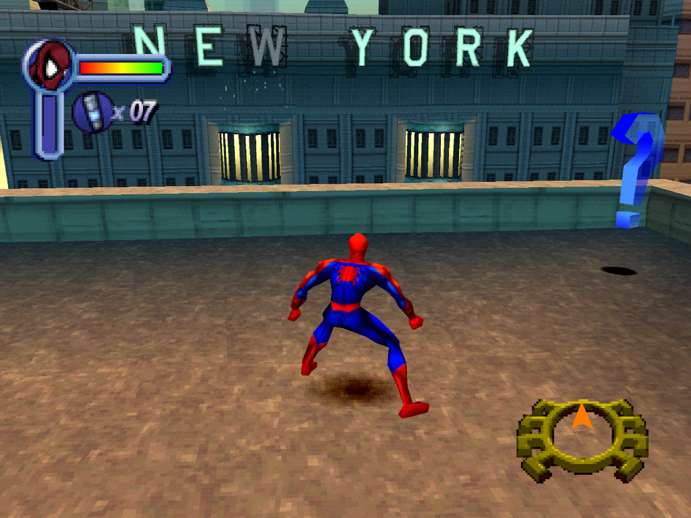
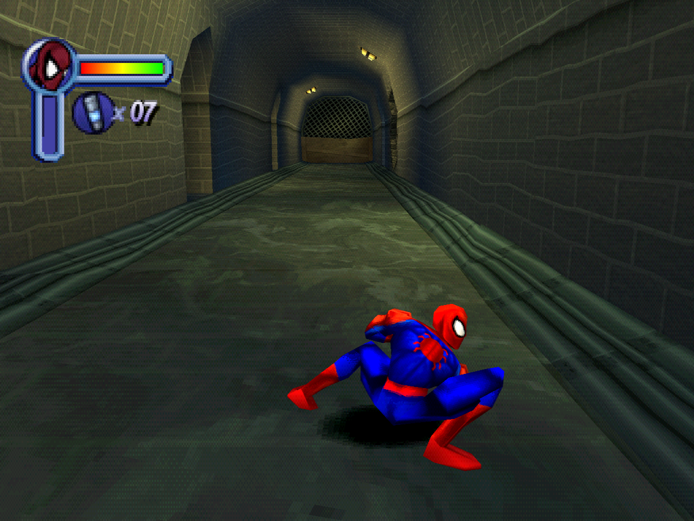
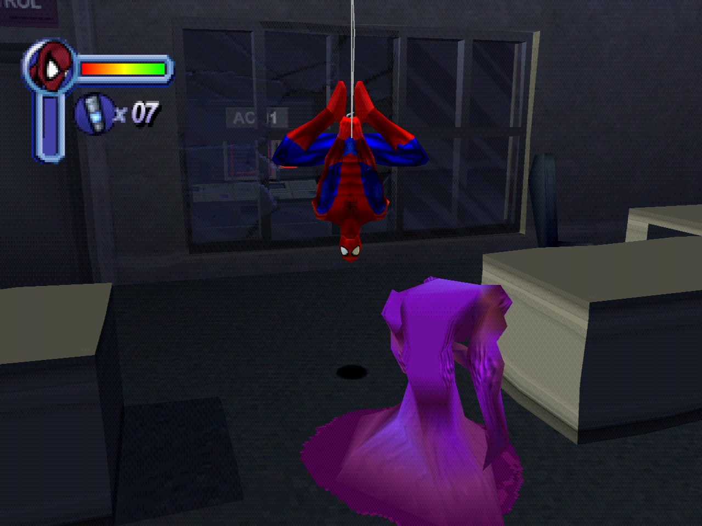
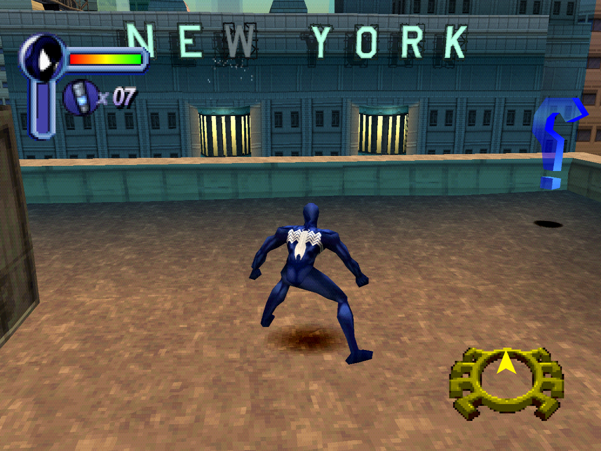
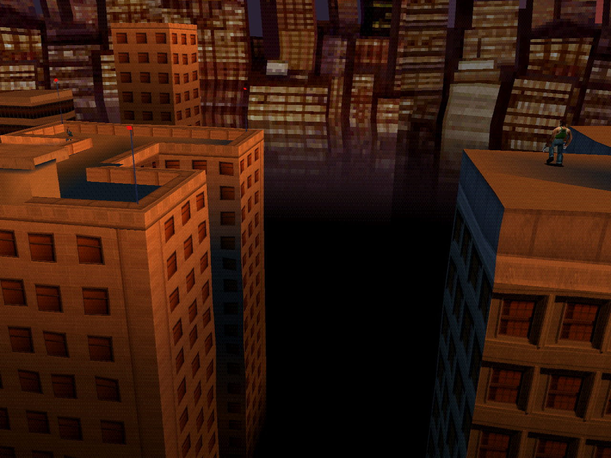
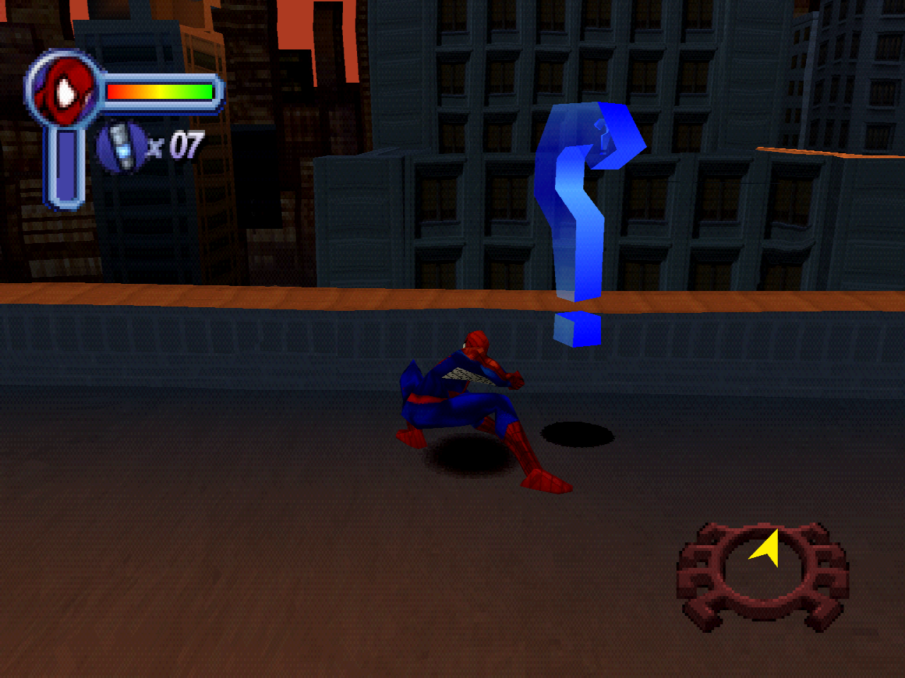

# OpenSpideyPS1

Native recompilations of the PlayStation Spider-Man games — Neversoft's Spider-Man and
Vicarious Visions' Spider-Man 2: Enter Electro — built with
[RecompOne](https://github.com/BlackLabelHQ/RecompOne). The PlayStation executable is
translated to C# ahead of time and linked against a runtime that reimplements the console's
libraries, so the result is an ordinary .NET application rather than an emulator.

|  |  |
|:--:|:--:|
| [](docs/screenshots/level1-rooftop.png) | [](docs/screenshots/level5-sewers.png) |
| **Level 1** — rooftops over Manhattan, with the health bar, web cartridge count and Spidey compass | **Level 5** — the sewers, reached by booting straight into the act with `SPIDEY_LEVEL=l5a3` |
| [](docs/screenshots/level7-office.png) | [](docs/screenshots/costume-symbiote.png) |
| **Level 7** — hanging from a web line in an office interior | **Costumes** — the symbiote suit, selected with `SPIDEY_COSTUME=symbiote` |
| [](docs/screenshots/sm2-e1m0-rooftops.png) | [](docs/screenshots/sm2-e1m0-gameplay.png) |
| **Enter Electro, episode 1** — the opening shot over the rooftops | **Enter Electro** — the first level in play, with the health bar, web cartridges and spider-sense compass |

---

## The two games are siloed, deliberately

This repository holds **more than one game**, and they do not share game code, configuration,
data or build output. Only the recompiler and its runtime are shared.

```
tools/RecompOne/     the recompiler and runtime -- SHARED
tools/enginematch.py carries hand-identified names between titles -- SHARED, game-agnostic
spiderman/           Spider-Man (USA, SLUS-00875)                  -- self-contained
spiderman2/          Spider-Man 2: Enter Electro (USA, SLUS-01378) -- self-contained
```

Each game directory owns its own `config/`, `patches/`, `port/`, `tools/` and `extracted/`.
Nothing in one game's directory refers to the other's, and neither is buildable from the
other's outputs.

**If you are adding a third game, keep it that way.** Put everything game-specific under
its own directory. Anything that would need to be shared belongs in `tools/`, and a change
there must be game-agnostic — the whole point of the split is that a fix for one game cannot
quietly break the other. Two games' worth of hand-written patches in one directory becomes
unpickable very quickly.

The silo held while Spider-Man 2 was added. Its hand-identified function names *came from*
Spider-Man's, but through `tools/enginematch.py`, which takes both executables as arguments
and belongs to neither game; the result is committed under `spiderman2/config/funcmaps/`, so
neither game reads the other's files or needs the other's build. The two shared-runtime fixes
Spider-Man 2 required were made game-agnostic, and Spider-Man was rebuilt and re-run to
level 1 gameplay afterwards to confirm they changed nothing for it.

---

## What works

### Spider-Man 2: Enter Electro

Boots, plays its logos and intro movie, reaches every menu, and a new game reaches the first
level and plays it.

- **The same engine.** `CD.HED`/`CD.WAD`, the relocatable-overlay format and the relocator
  are identical to Spider-Man's — 7,381 relocations decoded with zero errors — so the whole
  pipeline was retargeted rather than rediscovered, and the port built and booted on its
  first recompile.
- **First level.** Episode 1 mission 0, reached through the real menu path in 3 of 3 runs,
  then 10,000+ frames of live gameplay with no frozen stretch: HUD, pickups, physics, camera,
  working controls.
- **Frame pacing.** In gameplay the engine updates and draws at 14.9/s, the runtime presents
  at 29.6/s, and the game's own VSync callback receives 59.3 vblank IRQs/s. Like Spider-Man
  it never calls `VSync` in gameplay, so the GPU busy model paces the loop.
- **Audio.** SPU voices measured at full-scale peak, with XA and MDEC feeding the movies.
- **Level select and cheats.** All ten of the game's own cheat handlers read off and
  reproduced; `SPIDEY_LEVEL` boots any of 44 level prefixes.
- **Modern rendering.** Gameplay defaults to true 16:9, PS1 dithering is permanently
  removed, and host-resolution FXAA is enabled by default. A one-process audit captured
  four ordered in-game frames for every story prefix: 20 reached gameplay, while four
  existing model-init failures remain explicit failures.

Not verified: finishing a level, the memory card, and the four prefixes that currently
fail before their first renderable frame. See
[spiderman2/TO_DO.md](spiderman2/TO_DO.md).

### Spider-Man

Boots, plays its logos and intro movie, reaches every menu and plays.

- **Frame pacing.** The game never calls `VSync` during gameplay: it submits an ordering
  table and spins on `DrawSync` until the GPU has finished, and that spin *is* the frame. The
  runtime's `DrawSync` answered "idle" always, so the game ran at 131 fps. It is now paced by
  a GPU busy model: 14.8 gameplay updates/s, 29.6 presents/s and 59.2 vblank callbacks/s.
- **Levels.** 21 level prefixes were booted directly and every one reached gameplay and held
  7000 frames — all eight story levels plus the bonus set.
- **Memory card.** Saves and loads. A save written through the menus appears on the card and
  is listed back by name with its level and difficulty.
- **Costumes, cheats, level select** are reachable, and settable directly from the command
  line for testing.
- **Audio.** SPU voices and XA streaming, both measured. The intro movie decodes at 14.84
  frames a second, which is the 15 fps an STR is.

Not verified: finishing a level. A timed button script cannot play a 3D action level to its
end, and the act-advance trigger gates on trigger state rather than being a call that can
simply be invoked. See [spiderman/TO_DO.md](spiderman/TO_DO.md).

---

## Building

You need the retail disc once. **No game data is included here, and none should ever be
committed.** BIN/CUE is import media, not the runtime format: `tools/disc.py` extracts
individual files plus `recompone-disc.json`, and every later tool and game launch reads
that loose directory. XA and STR files retain their 2336-byte Mode 2 sectors so their
stream metadata is not lost. After both games have been imported, the images are no
longer needed for building, recompiling, or playing.

Needs .NET 10 and Python 3 with `numpy` and `PIL`. Put the disc at the repository root, then:

Both games follow the same five steps, from their own directory:

```bash
cd spiderman        # or: cd spiderman2
python tools/disc.py extract extracted
python tools/cdwad.py extract extracted/wad
python tools/overlays.py build config/overlays
python tools/genmaps.py
python tools/build.py
```

The generated config points RecompOne at `extracted/`, not at BIN/CUE. Passing an image
to a built port also performs this import once and stores the loose directory in
`settings.json`; subsequent launches prefer the loose manifest and do not reopen the
image. `CD.WAD` entries are served from `extracted/wad/` in both games, so archive
contents are loose and directly replaceable too. Set `SPIDEY_DATA` during that first
import to choose another destination.

`tools/build.py` runs the whole loop and stops when the unmapped-call count stops falling.
Spider-Man converges at 3,314 functions across 31 modules; Spider-Man 2 at 3,262 across 29.

```bash
./spiderman/port/bin/Release/net10.0/SpiderMan.exe
./spiderman2/port/bin/Release/net10.0/SpiderMan2.exe
```

## Switches

Both ports share the `SPIDEY_*` prefix; the level names and the cheat lists differ.

```
SPIDEY_HZ=30               host presentation/GPU pacing budget (default 30 Hz)
SPIDEY_LEVEL=l5a3          boot straight into a level (Spider-Man: 47 prefixes,
                           l1a1..l9a4; Spider-Man 2: 44, e1m0..e6m4 plus the
                           training, warm-up and demo sets)
SPIDEY_COSTUME=symbiote    Spider-Man only: 2099 symbiote captain unlimited bagman
                           scarlet benreilly quickchange peterparker
SPIDEY_CHEATS=all          the game's own cheats, each read off its own handler
SPIDEY_SHOTS=1050,1500     write a PNG on these frames
SPIDEY_SNAP=crash          dump the game's RAM on the crash, or on named frames
SPIDEY_WIDE=0              disable SM2's default 16:9 gameplay (1 enables it in SM1)
RECOMP_RENDER_SCALE=4      internal rendering scale, 1..8
RECOMP_FXAA=0              disable the default host-resolution FXAA pass
```

The per-game notes are the interesting reading. [spiderman/README.md](spiderman/README.md)
covers how the archive, the relocatable overlays and the SDK symbol recovery work, and
[spiderman/TO_DO.md](spiderman/TO_DO.md) what each bug turned out to be — including the
several that turned out *not* to be the cause, recorded with their evidence.
[spiderman2/README.md](spiderman2/README.md) covers carrying a symbol map between two games
built on one engine, and [spiderman2/TO_DO.md](spiderman2/TO_DO.md) records the investigation
of a "hang" that turned out to be the game waiting for the player — including the three
plausible causes that measurement killed first.

The added Dreamcast release is kept as a reference extraction rather than a third port.
[`dreamcast/README.md`](dreamcast/README.md) records its complete filesystem extraction,
decoded models/textures/audio/scripts, usable FMV conversion, and the measured comparison
between its high-detail Spider-Man model and both PS1 games.

## Licence

The code here is the ports and their tooling. Spider-Man, Spider-Man 2: Enter Electro and
their assets are the property of their respective rights holders; nothing from either disc is
distributed with it.
